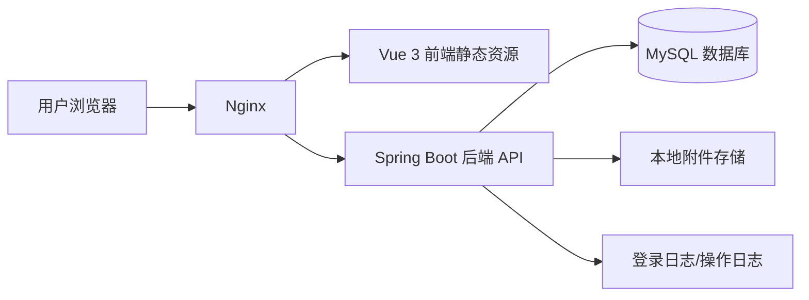

# 项目计划书

**项目名称：** 高校综合信息管理系统  
**学    院：** 计算机学院  
**小组序号：** 32  
**成员姓名：** 钟磊/仇欣皓/曹伟/罗旭/金凡竣
**指导老师：** 尹兆远  
**提交日期：** 2026年4月23日  

---

## 一、项目概述

### 1. 项目背景

高校日常管理中存在大量基础数据和业务数据，例如用户账号、部门组织、学生档案、教师档案、课程信息、通知公告、申请审批、附件材料和操作日志等。若这些信息长期分散在表格、聊天记录和零散文件中，会带来数据重复录入、查询效率低、权限边界不清晰、审批过程不可追踪等问题。

本项目面向高校信息化管理场景，设计并实现一套基于 Web 的综合信息管理系统，将基础数据管理、业务数据维护、审批流转、附件管理和日志审计整合在同一平台中，为管理人员和教师用户提供统一的数据入口和业务操作入口。

### 2. 项目目标

项目目标是完成一套可运行、可演示、可继续扩展的前后端分离信息系统，主要包括：

- 建立统一登录入口，实现 JWT 登录认证。
- 建立用户、角色、菜单、按钮权限体系，实现动态菜单和权限控制。
- 实现部门、学生、教师等基础数据管理。
- 实现课程、公告、申请等业务数据管理。
- 实现申请提交、审批通过、审批驳回和流转记录查询。
- 实现附件上传、下载、删除以及业务数据删除后的附件联动清理。
- 实现登录日志和操作日志，满足基本审计要求。
- 完成后端自动化测试、前端 E2E 冒烟测试和部署文档。

### 3. 开发环境与条件

开发工具与运行环境如下：

| 类别 | 方案 |
| --- | --- |
| 前端开发工具 | HBuilder X、VS Code 或其他支持 Vue 的编辑器 |
| 后端开发工具 | IntelliJ IDEA 2024.3.2 |
| 前端技术 | Vue 3、JavaScript、Vite、Pinia、Vue Router、Element Plus、Axios |
| 后端技术 | Java 17、Spring Boot 3、Spring Security、JWT、MyBatis |
| 数据库 | MySQL 8.0 |
| 测试工具 | JUnit 5、Spring Boot Test、Playwright |
| 部署环境 | Ubuntu、Nginx、systemd、MySQL |
| 版本管理 | Git、GitHub |

---

## 二、需求分析

### 1. 目标用户与使用场景

系统主要面向以下用户：

| 用户角色 | 使用场景 |
| --- | --- |
| 系统管理员 | 维护用户、角色、菜单、权限、部门，查看系统日志 |
| 教师用户 | 查看教师信息，参与业务申请与审批相关操作 |
| 业务管理员 | 维护学生、教师、课程、公告、申请等业务数据 |
| 审批人员 | 查看待办任务，对申请执行通过或驳回 |

典型使用流程如下：

1. 用户通过登录页输入账号和密码。
2. 后端校验账号后签发 JWT。
3. 前端根据当前用户权限加载动态菜单。
4. 用户进入对应模块执行查询、新增、编辑、删除、导入、导出等操作。
5. 关键操作写入操作日志。
6. 申请类业务可进入审批流程，并记录流转过程。

### 2. 核心功能清单

1. 登录与退出。
2. 个人中心修改密码。
3. 工作台统计与待办展示。
4. 用户管理。
5. 角色管理。
6. 菜单管理与按钮权限控制。
7. 部门管理。
8. 学生管理。
9. 教师管理。
10. 课程管理。
11. 公告管理。
12. 申请管理。
13. 工作流审批任务。
14. 附件上传、下载、删除。
15. 登录日志和操作日志查询。

### 3. 非功能需求

性能要求：

- 常规分页查询在普通开发环境中应能在 2 秒内返回。
- 前端路由按需加载，减少首屏无关页面加载。
- 后端列表查询均采用分页，避免一次性加载大量数据。

安全要求：

- 登录后使用 JWT 访问受保护接口。
- 后端基于权限码执行接口级鉴权。
- 前端基于权限码控制菜单和按钮显隐。
- 密码相关日志脱敏，不记录明文密码。
- 重要数据采用逻辑删除，便于保留审计痕迹。

兼容性要求：

- 前端支持现代 Chromium 内核浏览器。
- 后端支持 JDK 17 运行环境。
- 数据库使用 MySQL 8.0，字符集统一为 `utf8mb4`。
- 系统支持 Ubuntu 原生部署。

---

## 三、技术路线

### 1. 总体架构

系统采用前后端分离架构，整体分为表现层、接口层、业务层、数据层和部署运维层。



前端负责页面展示、表单交互、路由守卫、动态菜单和按钮权限控制；后端负责认证鉴权、业务逻辑、数据校验、数据库访问、日志记录和附件处理；数据库保存系统配置、业务数据、审批记录、附件元数据和日志数据。

### 2. 主要技术

前端：

- 使用 `Vue 3` 构建单页应用。
- 使用 `Vite` 作为开发与构建工具。
- 使用 `Vue Router` 管理静态路由和动态路由。
- 使用 `Pinia` 保存登录用户、菜单和权限数据。
- 使用 `Element Plus` 快速实现后台管理界面。
- 使用 `Axios` 统一封装请求、JWT 注入和异常处理。
- 使用 `Playwright` 执行关键页面 E2E 冒烟测试。

后端：

- 使用 `Spring Boot 3` 搭建 RESTful API 服务。
- 使用 `Spring Security + JWT` 实现登录认证和接口鉴权。
- 使用 `MyBatis + XML` 实现数据访问。
- 使用 `MySQL 8.0` 保存业务数据。
- 使用 `JUnit 5 + Spring Boot Test` 进行后端集成测试。
- 使用 `Nginx + systemd` 作为原生部署方案。

### 3. 数据设计初步考虑

主要实体包括：

- 用户、角色、菜单、部门。
- 学生、教师、课程。
- 公告、申请、申请流转记录。
- 附件、登录日志、操作日志。

核心关系包括：

- 一个用户可拥有多个角色。
- 一个角色可拥有多个菜单和按钮权限。
- 一个部门可关联多个用户、学生、教师和课程。
- 一个申请单可拥有多条流转记录。
- 一个业务对象可关联多个附件。
- 一个用户可产生多条登录日志和操作日志。

---

## 四、进度安排

### 1. 阶段划分

| 阶段 | 主要任务 | 阶段成果 |
| --- | --- | --- |
| 第一阶段：选题与设计| 明确题目、确定技术栈、编写项目计划书 | 项目计划书、仓库初始化 |完成需求分析、系统架构、数据库设计、接口设计 | 设计文档、数据库表结构、接口清单 |
| 第二阶段：业务功能实现 | 完成登录、用户、角色、菜单、部门模块 | 基础权限链路可运行 |完成学生、教师、课程、公告、申请、附件、日志 | 主要业务链路可演示 |
| 第三阶段：测试与部署 | 完成自动化测试、页面回归、问题修复 | 测试记录、可运行系统 | 完成部署文档、说明书、最终汇报材料 | 软件说明书、部署说明、演示系统 |

### 2. 时间进度表

| 时间 | 计划内容 |
| --- | --- |
| 第 1 周 | 完成选题、项目计划书、Git 仓库建立 | 完成需求分析、总体架构设计、数据库初步设计 |
| 第 2 周 | 完成前后端脚手架、登录与用户模块 |完成角色、菜单、部门、动态权限模块 |
| 第 3 周 | 完成学生、教师模块及账号绑定 |完成课程、公告、申请、工作流模块 |
| 第 4 周 | 完成最终说明书、演示检查和答辩准备 |完成附件、日志、测试和部署文档 |

### 3. 风险与应对

| 风险 | 影响 | 应对措施 |
| --- | --- | --- |
| 需求范围过大 | 功能无法按期完成 | 优先完成核心 CRUD、权限和审批主链路 |
| 前后端接口不一致 | 联调效率低 | 先编写接口契约，再按契约实现 |
| 数据库表结构频繁变化 | 影响接口和页面稳定性 | 先确定核心表，后续只做增量调整 |
| 权限逻辑复杂 | 容易出现越权或按钮不一致 | 后端接口鉴权为准，前端只做体验层控制 |
| 部署环境差异 | 上线时容易出错 | 编写 Nginx、systemd、环境变量和备份文档 |
| Git 留痕不足 | 影响个人成绩认定 | 按模块小步提交，每个成员产出进入仓库 |

---

## 五、成员分工

### 1. 成员信息

本项目按 5 人小组进行分工：2 名成员负责前端，2 名成员负责后端，1 名成员负责测试、文档和质量保障。

| 成员 | 班级 | 学号 | Git 账号 | 角色 | 主要任务 | 对应成果 |
| --- | --- | --- | --- | --- | --- | --- |
| 罗旭 | 计算机科学与技术一班 | 202405567009 | jcctkl  | 前端开发1 | 登录页、主布局、动态菜单、工作台、个人中心 | 
| 曹伟 | 计算机科学与技术一班 | 202405567017 | cw749 | 前端开发2 | 用户、角色、菜单、部门、学生、教师、业务页面和附件交互 | 
| 仇欣皓 | 计算机科学与技术一班 | 202405567018 | Agoni18 | 后端开发1 | 登录认证、JWT、权限、用户、角色、菜单、部门、日志 | 
| 钟磊 | 计算机科学与技术一班 | 202405567015 |  l1160 | 后端，架构设计 | 学生、教师、课程、公告、申请、工作流、附件、数据库脚本 | 
| 金凡竣 | 计算机科学与技术一班 | 202405567004 |   SitDForget | 测试与文档 | 后端集成测试、前端 E2E、部署文档、说明书、Git 过程材料 |

### 2. Git 协作方式

项目使用 Git 进行版本管理，远端仓库使用 GitHub：

- 主分支：`main`，保存稳定版本。
- 功能开发：按模块建立功能分支，例如 `feature/auth`、`feature/user-management`。
- 提交方式：完成一个小功能或文档章节后提交一次，提交信息描述实际修改内容。
- 阶段标签：按课程阶段打标签，例如 `v1-plan`、`v2-design`、`v3-final`。
- 证据要求：代码、文档、测试、数据库设计、会议记录等均进入仓库，作为个人工作量证明。

提交信息示例：

```bash
git commit -m "完成登录认证接口"
git commit -m "补充数据库表结构设计"
git commit -m "新增学生管理页面"
git commit -m "补充前端E2E测试"
```

### 3. 阶段性成果计划

| 阶段 | 拟提交成果 |
| --- | --- |
| 计划阶段 | 项目计划书、仓库 README、任务分工 |
| 中期阶段 | 需求分析、架构设计、数据库设计、接口清单、核心页面原型 |
| 开发阶段 | 前端页面、后端接口、数据库脚本、测试用例 |
| 结项阶段 | 软件说明书、部署说明、测试结果、最终演示系统 |

---

## 附录

1. 远端 Git 仓库信息：(https://github.com/l1160/xtu_system)
2. 本地项目目录：`/home/zlroot/code/xtu_system`。
3. 演示账号：管理员 `admin / admin123`，教师 `teacher01 / teacher123`。
4. 主要运行命令：
```bash
cd backend && DB_USERNAME=root DB_PASSWORD=123456 mvn spring-boot:run
cd frontend && npm run dev
```
